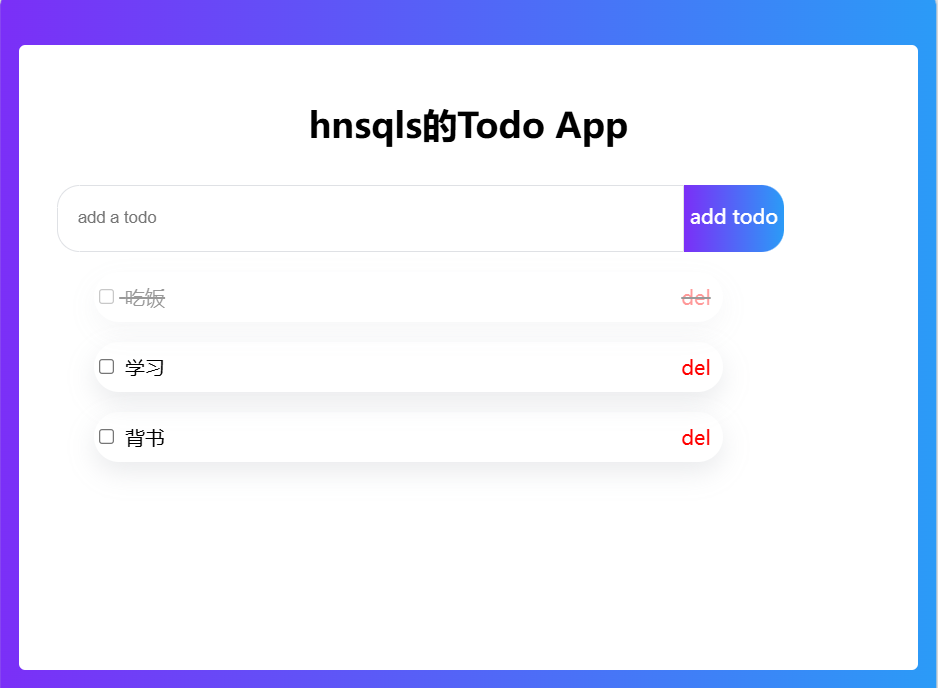

## HTML和CSS

做成如下页面



不知道怎么实现或者某个api不记得直接问AI。

复盘一下，在实现这个页面的时候，margin设置了但是没有生效，那就设padding,设了padding后，整个元素大小会变，可以使用box-sizing: border-box;

盒子的阴影的实现

```css
 box-shadow: rgba(149, 157, 165, 0.2) 0px 8px 20px;
```

## JS

大概语法

## Vue

变量的创建，变量的使用，在Script中用xxx.value，在templete中直接{{xxx}}。双向绑定，动态类名绑定，集合渲染，事件函数。

监听器，动态展示，组件的使用，父组件传参，子组件向父组件传值。

